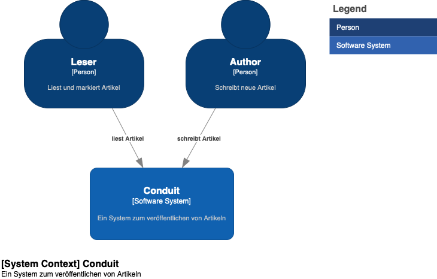

# Kontextabgrenzung

**Leser**

Leser können veröffentlichte Artikel lesen. Sie können auch Authoren folgen, damit Sie über neue Artikel informiert werden.

**Author**

Ein Author kann neue Artikel erstellen und mit Tags versehen.

**Conduit**

Conduit ist das System für das erstellen und verteilen von Artikeln. Das System wird als Webanwendung für die Leser und Authoren bereitgestellt.
